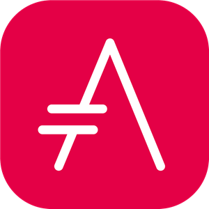

= Asciidoc

== Hva er problemet
* Vi er ikke fan av LaTeX
 - Overleaf er slitsomt
 - Det er for mye guff
 - Vi kan ikke LaTeX

== Hva vil vi ha i et verktøy
* Nå skal vi skrive i et år
 - Hvorfor ikke bruke verktøy vi er flinke med?
* Vi ville gjerne:
 - Bruke VSCode
 - Bruke git og GitHub
 - Bruke Vim (og ikke bruke Vim)

== LaTeX
* Kan gjøre alt vi måtte trenge
* Kan bruke git
* Kan rendres lokalt, men slitsomt
* Tett kobling mellom struktur og innhold
* Vanskelig å detaljstyle

== Word
* Umulig å versjonskontrolere
* Lite customizable
* Upresis layout kontroll
* Ser stygt ut

== HTML
* Presis layout (css)
* Vi kan det godt
* Vanskelig å lese raw
* Slitsomt å skrive

== Markdown
* Liten kobling mellom struktur og innhold
* Lett å lese og å skrive
* Mangler avanserte funksjoner
 - Table of contents
 - Siteringer
 - Formler
 - Seksjonreferanser

== Asciidoc
* Liten kobling mellom struktur og innhold
* Lett å lese og å skrive
* Har plugins for funksjonene vi trengte

== La oss ta en titt på Asciidoc

== Toolchain
* Malen
* VS Code Plugins
* Netlify
* Scripts for hot reload
* Bra generering av PDF for print
* Grammarly
* Zotero

== Zotero
* Siteringsbibliotek
* Del bibliotek
* Auto generer bibtex fil

== Lets asciidoc

== Oppgave 1
* Lag et nytt repo på github
* Skriv en adoc fil om favorittfilmen din
* Den skal inkludere:
 - Overskrift
 - Avsnitt om hvorfor du liker filmen
 - Et bilde relatert til filmen
 - En punktliste med viktige skuespillere

== Oppgave 2
* Klon malen
* Følg getting started
* Compile locally

== Andre tips og triks
* Citations hack
* Parskriving
* Voice to speech for skrivesperre
* Ha det gøy
