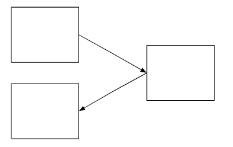

[[background_theory_and_motivation]]
== Background Theory and Motivation

Lorem ipsum dolor sit amet, consectetur adipiscing elit.
Nam consequat pulvinar hendrerit.
Praesent sit amet elementum ipsum.
Praesent id suscipit est.
Maecenas gravida pretium magna non interdum.
Donec augue felis, rhoncus quis laoreet sed, gravida nec nisi.
Fusce iaculis fermentum elit in suscipit.

[[background_theory]]
=== Background Theory

The background theory depth and breadth depends on the depth needed to understand your project in the different disciplines that your project crosses.
It is not a place to just write about everything you know that is vaguely connected to your project.
The theory is here to help the reader that does not know the theoretical basis of your work so that he/she can gain sufficient understanding to understand your contributions.
In particular, the theory section provides an opportunity to introduce terminology that can later be used without disturbing the text with a definition.
In some cases it will be more appropriate to have a separate section for different theory.
However, watch that you don't end up with too short sections.
Subsections may also be used to separate different background theory.

When introducing techniques or results, always reference the source.
Be careful to reference the original contributor of a technique and not just someone who happens to use the technique.
For relevant results to your work, you would want to look particularly at newer results so that you have referenced the most up-to-date work in your area.
If you don't have the source handy when writing, mark the test that a reference is needed and add it later.

Web pages are not reliable sources, they might be there one day and removed the next; and thus should be avoided, if possible.
A verbal discussion is not a source and should not be referenced or described in the text.

The bulk of citations in the report will appear in xref:background_and_motivation[].
However, you will often need to introduce some terminology and key citations already in this chapter.

You can cite papers in the following manners:

- One paper: citenp:[ellicksonCoaseCattleDispute1986]
- More papers: citenp:[mandelbrotHowLongCoast1967, ellicksonCoaseCattleDispute1986]

*Introducing figures:

[[example_diagram]]
.Boxes and arrows are nice.

Remember that when you borrow figures you should always credit the original author.
Also don't just put the figure in and leave it to the author to try to understand what the figure is.
The figure should be put in to convey a message and you need to help the author to understand the message intended by explaining the figure in the text.

*Introducing tables in the report:*

[[fruit_colors]]
.An adoc table describing some common fruits and their colors.
include::../tables/adoc_table.adoc[]

[[movies]]
.A csv table describing the top five movies by IMDB ranking citenp:[usersIMDbTopRated].
include::../tables/adoc_table.adoc[]

As you can see from Table xref:fruit_colors[] and xref:movies[], tables are nice.
However, again, you need to discuss the contents of the table in the text.
You don't need to describe every entry but draw the reader's attention to what is important for them to glean from the table.

With asciidoc you can include tables in two ways.
Either by creating a table in ascidoc, as is done for xref:fruit_colors[] or by including a csv directly as is done for xref:movies[].

=== Structured Literature Review Protocol

Here you need to include your structured review protocol including search engine, search words, research questions  (for search, not the masters research questions), inclusion criteria and evaluation criteria.

[[motivation]]
=== Motivation

Your motivation can be either application-driven or technique/methodology-driven.
However in both cases, there will be an element of methodology driven due to the research focus of our group and the nature of a masters project.
What other research has been conducted in this area and how is it related to your work?
The text should clearly illustrate why your goals and research questions are important to address.
This section is thus where your literate review will be presented.
It is important when presenting the review that you present an overview of the motivating elements of the work going on in your field and how these relate to your proposal, rather than a list of contributors and what they have done.
This means that you need to extract the key important factors for your work and discuss how others have addressed each of these factors and what the advantages/disadvantages are with such approaches.
As you mention other authors, you should reference their work.
Note that the reference list reflects the literature you have read and have cited.
This will only be a subset of the literature that you have read.
